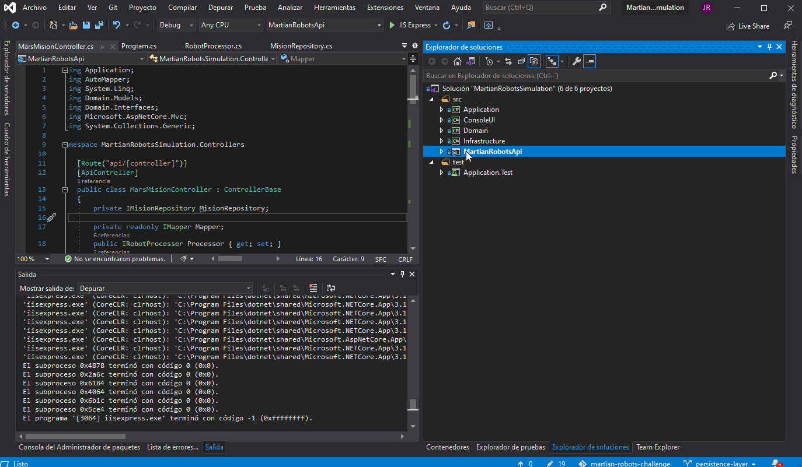
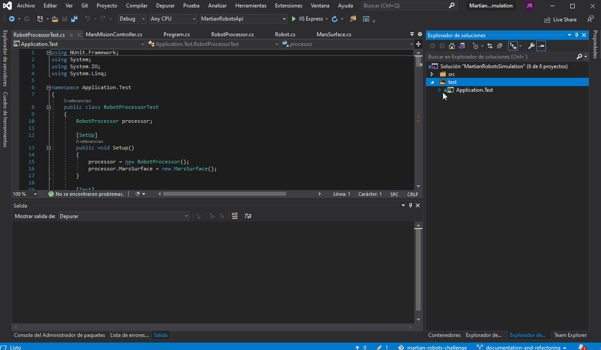

# martian-robots-challenge
Software for the Mars mission. It processes basic commands like R L F , positioning the robot in the target point and without a limit in robots to send. At first, there are several validations then it will process the instructions for each robot, scents help to do not lose robots at the same coordinates.

This solution was made with .NetCore 3.1 with a domain-driven architecture.
Also, use the following NuGet packages:

| Package | Description |
| :---: | :---: | 
| NUnit | To implement the project unit testing in Application.Test. | 
| EntityFrameworkCore | For accessing & storing the data in the SQLite database. |
| Swagger | To create the WebApi documentation. | 
| AutoMapper | To map multiple objects easily. |
| Newtonsoft | Json Serialization. To return JSON objects without having to have many tables. This would change if necessary for now we have just one database table |

A picture is worth a thousand words (But better with a gif):

WebAPi:

As you can see in the index you can find the information and examples of how to execute the Api.
Through the API you can access the information stored in a SQLite database.

Test Project:

You can find files with some possible scenarios in a mars mission for instance wrong input commands, length of the parameters, invalid characters as well as examples for successful missions.

The project Test for the core logic using Nunit, you can find all the test cases in this project that includes the happy path, interesting path and exceptional path. In the folder TestData I have prepared some files with a set of instructions with different examples 
exampleInput.txt contains

The solution contains 5 projects:

| Project | Description |
| :---: | :---: | 
| Application | All the business logic the main method is RobotProcessor. |
| Domain | All the Interfaces, classes and model needed for all the software| 
| Infrastructure | Contain the database access. For the persistence layer I use Entity framework for SQLite with the Code-First approach. |  
| MartialRobotApi | Through the API you can access the information stored in a SQLite database, it is well documented as well | 
| Application.Test | Unit test for all the public methods in the Application Layer |  

